# AEMOVis Walkthrough

## Introduction

AEMOVis is a real-time visualisation dashboard for Australia's electricity markets. It draws live data from both the **National Electricity Market (NEM)** — covering NSW, QLD, VIC, SA, and TAS — and the **Wholesale Electricity Market (WEM)** in Western Australia.

The core design principle is that **markets are not first-class citizens — the type of visualisation is**. Each page represents a distinct analytical lens (price trends, fuel mix, renewable penetration, etc.) rather than a single market. Where the same visualisation applies to both NEM and WEM, both data sources are available on the same page, and the **Compare** feature allows multiple regions to be viewed side by side. This lets analysts compare across market boundaries in a single view.

### Key Features

- **15 visualisation pages** covering price, demand, generation, fuel mix, renewables, outlook, reserves, and outages
- **Compare mode** on applicable pages — overlay XY charts or display side-by-side pie/donut charts for multiple regions simultaneously
- **Live polling** with 60-second refresh and stale-data guards
- **Responsive layout** for desktop, tablet, and mobile

---

## Table of Contents

1. [Dispatch Overview](#1-dispatch-overview)
2. [Price and Demand](#2-price-and-demand)
3. [Cumulative Price](#3-cumulative-price)
4. [Fuel Mix](#4-fuel-mix)
5. [Renewable Penetration](#5-renewable-penetration)
6. [Average Price](#6-average-price)
7. [7-Day Outlook](#7-7-day-outlook)
8. [FCAS Prices](#8-fcas-prices)
9. [Net Interchange](#9-net-interchange)
10. [WEM Outages](#10-wem-outages)
11. [WEM Energy Price](#11-wem-energy-price)
12. [DPV vs Demand](#12-dpv-vs-demand)
13. [WA Dispatch](#13-wa-dispatch)
14. [WA Reserves](#14-wa-reserves)
15. [WA Gen Map](#15-wa-gen-map)

---

## 1. Dispatch Overview

The landing page provides a bird's-eye view of all six NEM regions (NSW, QLD, VIC, SA, TAS) plus WA. Each region card shows the current spot price, demand and generation bars, and interconnector flows. This is the fastest way to assess the state of the entire Australian grid at a glance.

- **Spot price** displayed prominently per region
- **Demand vs generation** horizontal bars show supply-demand balance
- **Interconnector flows** table shows import/export between neighbouring regions
- WA is sourced from the WEM pulse feed; NEM regions from the AEMO dispatch API

### Data Source

| Aspect | NEM | WEM |
|--------|-----|-----|
| **Endpoint** | `/NEM/v1/PWS/NEMDashboard/elecSummary` | `pulse.csv` |
| **Base URL** | `dashboards.public.aemo.com.au` | `data.wa.aemo.com.au` |
| **Freshness** | 4.5 minutes | 25 minutes |
| **Poll interval** | 60 seconds | 60 seconds |
| **Fields** | `summary[]` (price, demand, gen, interconnectorFlows) | `TRADING_DAY_INTERVAL`, `ENERGY_PRICE`, `TOTAL_GEN_MW`, `TOTAL_DEMAND_MW` |

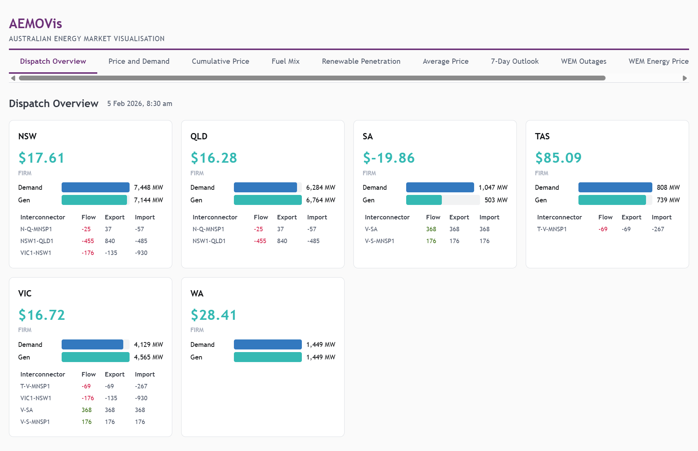

---

## 2. Price and Demand

A dual-axis time-series chart showing spot price ($/MWh, left axis) and demand (MW, right axis) for any selected region. Supports both 5-minute and 30-minute resolution for NEM regions, while WA displays ~4 days of rolling data from the WEM pulse feed.

- **Region selector** — click any region button to switch
- **Timescale selector** — toggle between 5MIN and 30MIN (NEM only)
- **Forecast overlay** — dashed lines show pre-dispatch forecast where available
- **APC marker** — dotted line at the Administered Price Cap threshold (NEM only)
- **KPI row** — current price, demand, forecast values, and APC status

### Compare Mode

Click **Compare** to overlay multiple regions on the same chart. Each region gets a distinct colour. Price lines are solid, demand lines are dashed. Forecast data appears as dotted lines. The APC marker is shown when at least one NEM region is selected.

### Data Source

| Aspect | NEM | WEM |
|--------|-----|-----|
| **Endpoint** | `/NEM/v1/PWS/NEMDashboard/priceAndDemand?timescale={5MIN|30MIN}` | `pulse.csv` |
| **Freshness** | 4.5 minutes | 25 minutes |
| **Time range** | ~2 days actuals + forecast | ~4 days rolling |
| **Fields** | `rrp`, `totalDemand`, `forecastedRrp`, `forecastedDemand` | `ENERGY_PRICE`, `TOTAL_DEMAND_MW` |

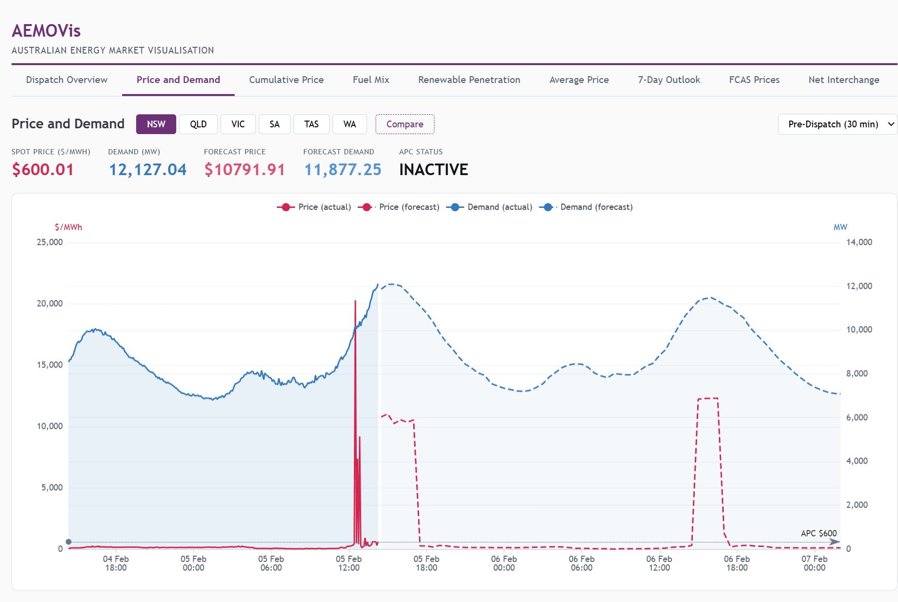

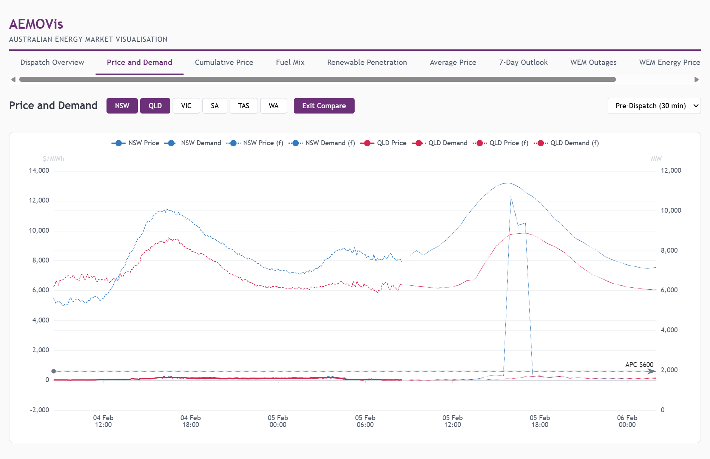

---

## 3. Cumulative Price

Tracks the running cumulative price sum across the trading day for each NEM region. This is critical for monitoring proximity to the **Cumulative Price Threshold (CPT)**, which triggers Administered Pricing if breached. The chart shows how each region's cumulative price evolves in real time.

- **Per-region cumulative totals** updated every dispatch interval
- **CPT threshold line** marks the trigger level
- WA is not applicable (WEM has a different pricing mechanism)

### Data Source

| Aspect | Value |
|--------|-------|
| **Endpoint** | `/NEM/v1/PWS/NEMDashboard/cumulativePrice` |
| **Freshness** | 4.5 minutes |
| **Market** | NEM only |
| **Fields** | `cumulativePrice` per region, `cpt` threshold |

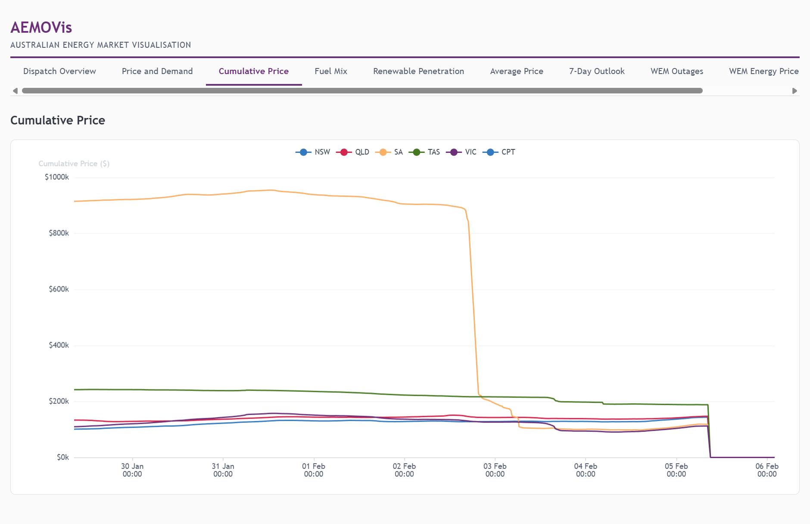

---

## 4. Fuel Mix

A donut chart breaking down current generation by fuel type for the selected region. Fuel types are colour-coded consistently (black coal = dark, wind = teal, solar = gold, gas = orange, hydro = blue, etc.) and ordered by the standard AEMO fuel hierarchy.

- **Region selector** — individual NEM regions, WA, or NEM aggregate
- **Total MW** displayed in the chart centre
- **Legend** with percentage breakdown
- WA fuel mix is derived by joining WEM generation data with facility metadata

### Compare Mode

Click **Compare** to see side-by-side pie charts for multiple regions. Pies are evenly distributed across the width and auto-size — radius shrinks gracefully as more regions are added.

### Data Source

| Aspect | NEM | WEM |
|--------|-----|-----|
| **Endpoint** | `/NEM/v1/PWS/NEMDashboard/fuelMix?type=CURRENT` | `generation.csv` + `facility-meta-fuelmix.csv` |
| **Freshness** | 4.5 minutes | 55 minutes |
| **Fields** | `fuelType`, `generationMW` | Joined via `FACILITY_CODE` to get `PRIMARY_FUEL` |

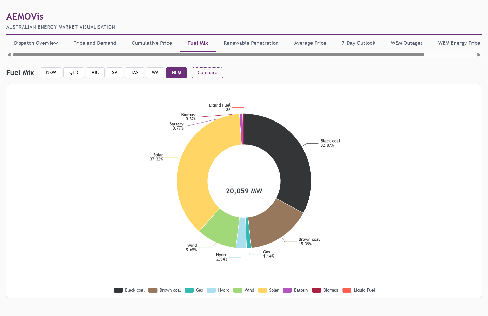

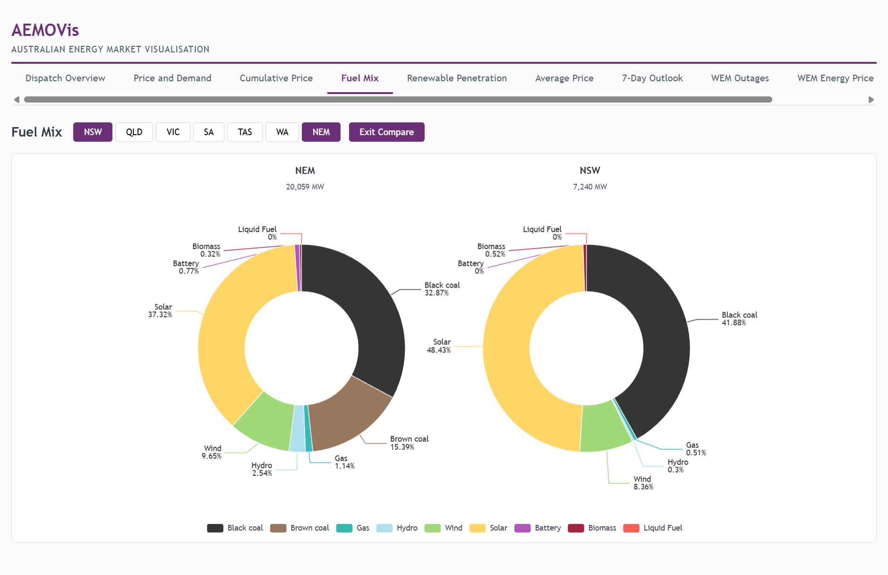

---

## 5. Renewable Penetration

A donut chart showing the percentage of current generation from renewable sources (wind, solar, hydro, biomass, battery, rooftop PV) versus non-renewable sources. The percentage is displayed prominently in the centre.

- **Region selector** — individual NEM regions, WA, or NEM aggregate
- Renewable classification covers: Wind, Solar, Hydro, Biomass, Battery, Rooftop PV, Distributed PV, Utility-scale Solar
- Green/dark colour scheme for clear visual distinction

### Compare Mode

Click **Compare** to see side-by-side donut charts showing renewable penetration for multiple regions simultaneously. Each donut displays its region label and percentage, making cross-regional comparison immediate.

### Data Source

Same as Fuel Mix — derived by classifying fuel types as renewable/non-renewable.

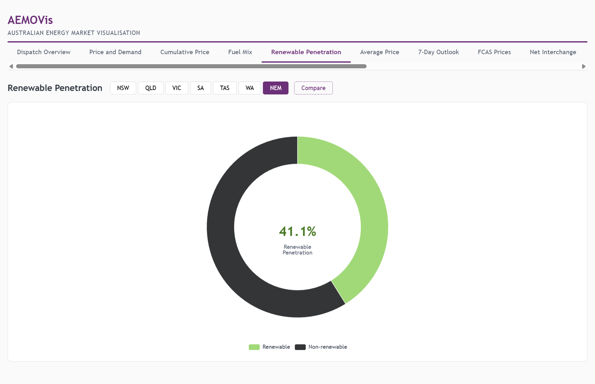

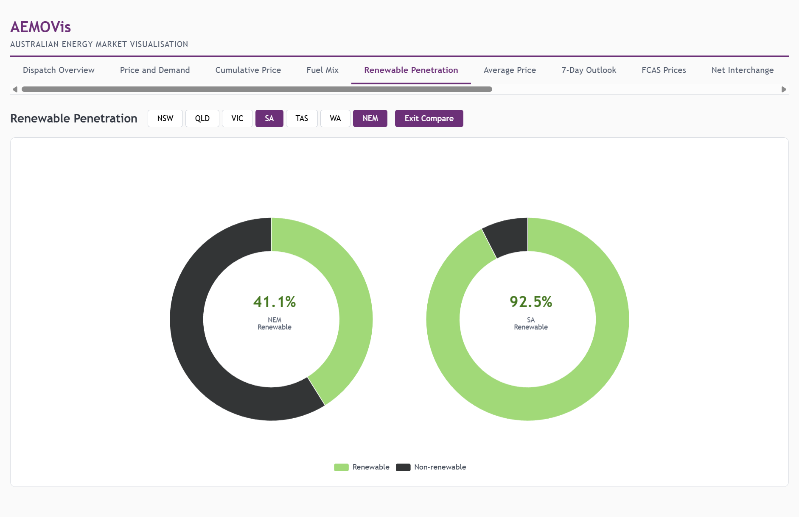

---

## 6. Average Price

Displays the average spot price for each NEM region as a bar chart, derived from the most recent dispatch data. WA average price is included, aligned to the NEM date window (~4 days from the WEM pulse feed).

- **Bar chart** comparing average price across all regions
- Colour-coded by region for quick identification
- Useful for spotting sustained price divergence between states

### Data Source

| Aspect | NEM | WEM |
|--------|-----|-----|
| **Endpoint** | `/NEM/v1/PWS/NEMDashboard/dailyAveragePrices?year={YYYY}&month={MM}` | `pulse.csv` |
| **Freshness** | 4.5 minutes | 25 minutes |
| **Calculation** | Pre-aggregated by AEMO | Computed from `ENERGY_PRICE` time series |

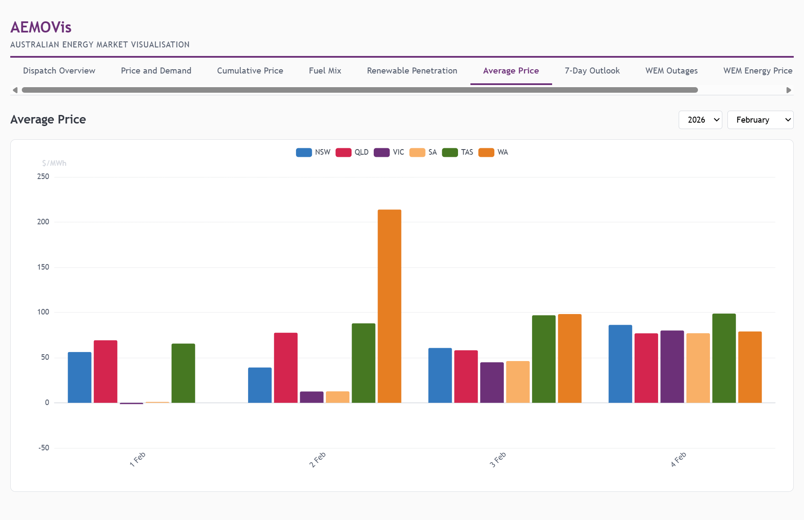

---

## 7. 7-Day Outlook

A tabular view of AEMO's Short Term Projected Assessment of System Adequacy (ST PASA), showing forecast demand, available capacity, and reserve margins for each NEM region over the coming seven days.

- **Daily breakdown** with peak demand forecasts
- **Capacity and reserve** columns highlight potential shortfalls
- Critical for operational planning and market participant decision-making
- NEM only — WEM outlook data is not available via the same API

### Data Source

| Aspect | Value |
|--------|-------|
| **Endpoint** | `/NEM/v1/PWS/NEMDashboard/sevenDayOutlook` |
| **Freshness** | 4.5 minutes |
| **Market** | NEM only |
| **Fields** | `prettyDate`, `regionId`, `dataType`, `dataValue` (pivoted into table) |

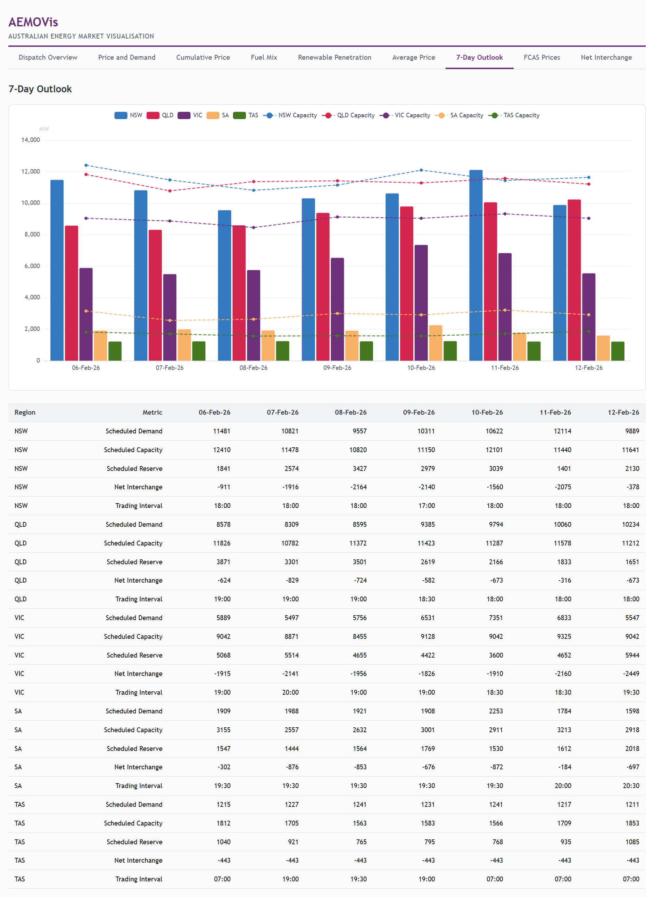

---

## 8. FCAS Prices

A heatmap displaying **Frequency Control Ancillary Services (FCAS)** prices across all NEM regions. FCAS markets are essential for maintaining grid frequency stability — generators and loads are paid to provide rapid response services.

- **Heatmap** with regions on the Y-axis, FCAS services on the X-axis
- **Colour intensity** represents price (blue scale: light = low, dark = high)
- **10 FCAS services** displayed: Raise/Lower for 1s, 6s, 60s, 5m, and Regulation
- **KPI row** shows average energy price, average FCAS price, highest FCAS price, and peak service/region

### FCAS Services Explained

| Service | Purpose |
|---------|---------|
| Raise 1s/6s/60s/5m | Increase generation/reduce load to raise frequency |
| Lower 1s/6s/60s/5m | Decrease generation/increase load to lower frequency |
| Raise/Lower Reg | Continuous regulation to maintain 50Hz |

### Data Source

| Aspect | Value |
|--------|-------|
| **Endpoint** | `/NEM/v1/PWS/NEMDashboard/elecSummary` (prices array) |
| **Freshness** | 4.5 minutes |
| **Market** | NEM only |
| **Fields** | `raise1SecRrp`, `raise6SecRrp`, `raise60SecRrp`, `raise5MinRrp`, `raiseRegRrp`, `lower1SecRrp`, `lower6SecRrp`, `lower60SecRrp`, `lower5MinRrp`, `lowerRegRrp` |

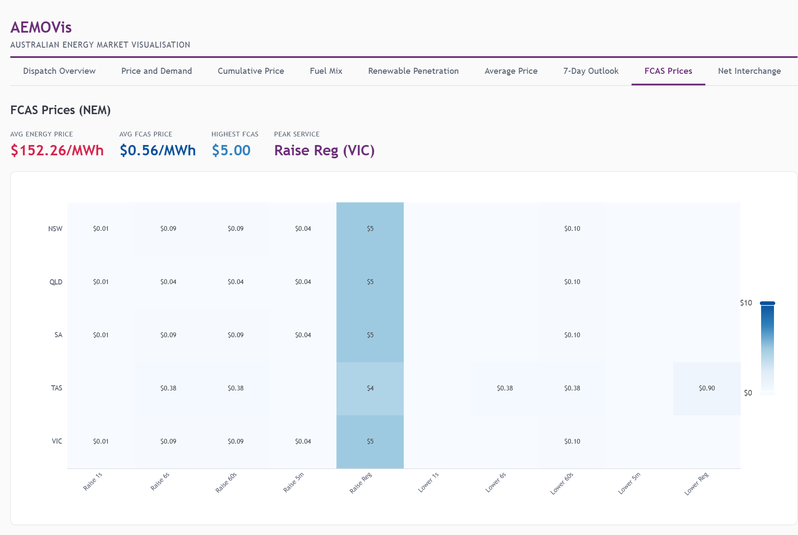

---

## 9. Net Interchange

Shows import/export flows between NEM regions over time. Positive values indicate a region is exporting power; negative values indicate importing. Also includes a **Gen Breakdown** toggle to view scheduled vs semi-scheduled generation.

- **Bar chart** showing net interchange per region over time
- **Colour coding**: green = exporting, red = importing
- **Region toggles** to filter which regions are displayed
- **Gen Breakdown** mode shows stacked area of scheduled (dispatchable) vs semi-scheduled (wind/solar) generation

### Data Source

| Aspect | Value |
|--------|-------|
| **Endpoint** | `/NEM/v1/PWS/NEMDashboard/priceAndDemand?timescale=30MIN` |
| **Freshness** | 4.5 minutes |
| **Market** | NEM only |
| **Fields** | `netInterchange`, `scheduledGeneration`, `semiScheduledGeneration` |

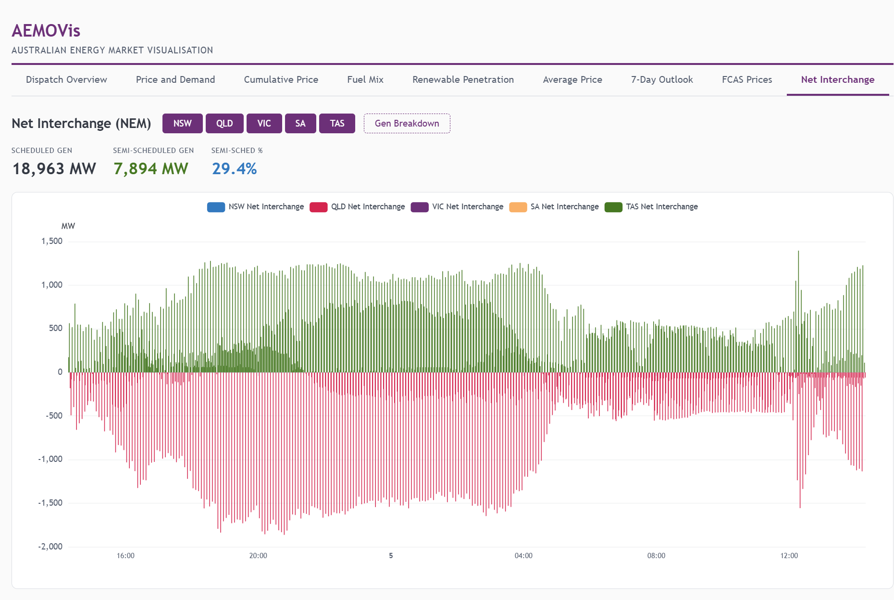

---

## 10. WEM Outages

Displays currently reported generation outages in the Western Australian Wholesale Electricity Market. When outages are active, they are listed with facility name, capacity affected, and outage type. When no outages are reported, a clear status message is shown.

- **Outage list** with facility details and MW impact
- **Total outage MW** summary card
- Sourced from the WEM outage CSV feed
- WEM-only page (NEM outage data uses a different reporting mechanism)

### Data Source

| Aspect | Value |
|--------|-------|
| **Endpoint** | `pulse.csv` (outage columns) |
| **Base URL** | `data.wa.aemo.com.au` |
| **Freshness** | 25 minutes |
| **Market** | WEM only |
| **Fields** | `OUTAGE_GEN_MW`, facility outage flags |

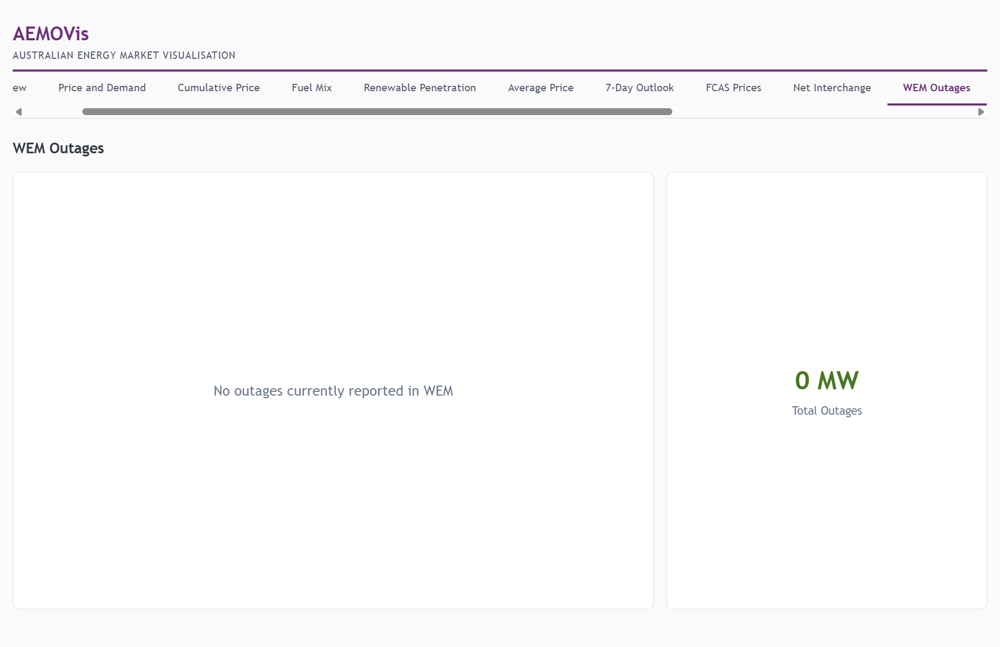

---

## 11. WEM Energy Price

> **Note:** This page overlaps with Price and Demand when WA is selected. Retained for direct WEM-focused access.

A simple time-series chart showing the WEM energy price over the rolling ~4-day window from the pulse feed. The current spot price KPI is displayed above the chart.

### Data Source

| Aspect | Value |
|--------|-------|
| **Endpoint** | `pulse.csv` |
| **Base URL** | `data.wa.aemo.com.au` |
| **Freshness** | 25 minutes |
| **Market** | WEM only |
| **Fields** | `TRADING_DAY_INTERVAL`, `ENERGY_PRICE` |

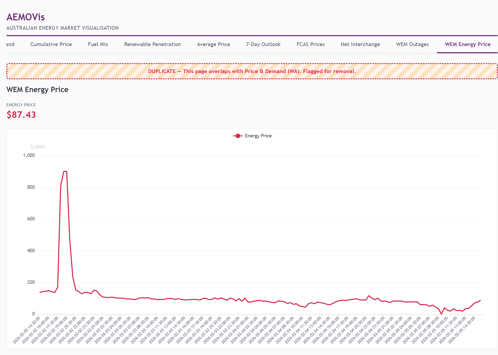

---

## 12. DPV vs Demand

A dual-axis chart specific to Western Australia, showing the relationship between grid operational demand and distributed photovoltaic (rooftop solar) generation. This is particularly important in WA where rooftop solar penetration is among the highest in the world and significantly impacts grid operations.

- **Operational Demand** (MW, left axis) — total grid demand
- **Distributed PV** (MW, right axis) — estimated rooftop solar output
- **KPI row** — current demand, current DPV, peak DPV, and minimum demand
- The inverse relationship between DPV and demand is clearly visible: as solar output rises during the day, net demand drops
- WEM-only page sourced from the DPV/operational demand CSV feed

### Data Source

| Aspect | Value |
|--------|-------|
| **Endpoint** | `distributed-pv_opdemand.csv` |
| **Base URL** | `data.wa.aemo.com.au/public/infographic/dpvopdemand/` |
| **Freshness** | 25 minutes |
| **Market** | WEM only |
| **Fields** | `TRADING_INTERVAL`, `OPERATIONAL_DEMAND_MW`, `ESTIMATED_DPV_MW` |

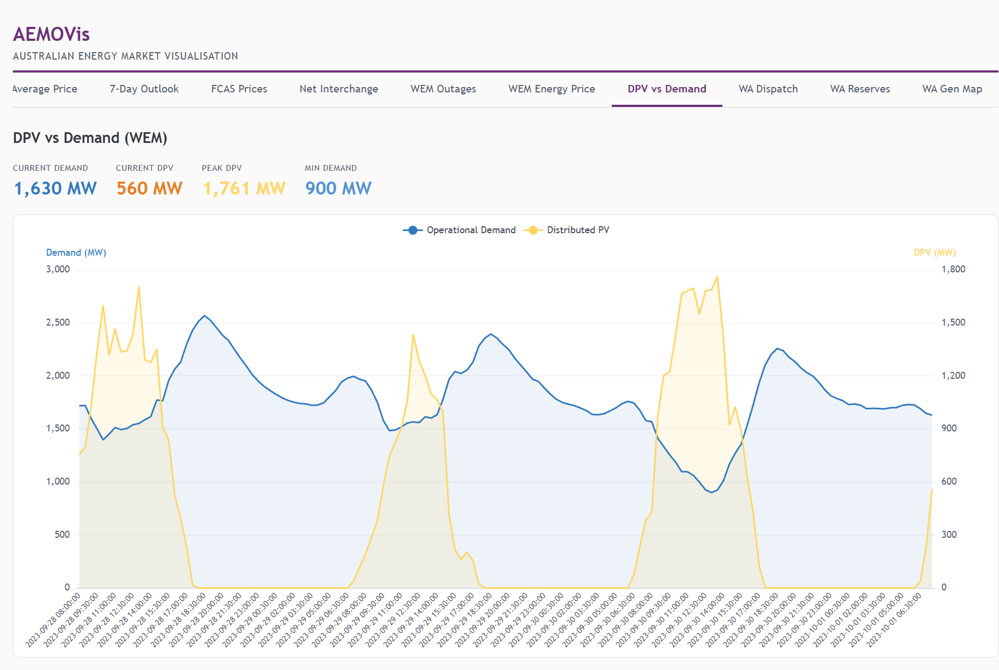

---

## 13. WA Dispatch

A stacked area chart showing WA generation by fuel type over 2 days (96 × 30-minute intervals), with a price line overlay. This provides a detailed view of Western Australia's generation mix and how it correlates with price movements.

- **Stacked area** by fuel type (Gas, Coal, Wind, Solar, Battery, etc.)
- **Price overlay** (red line, right axis) shows energy price trajectory
- **KPI row** — current generation, current price, peak generation, capacity utilization
- Fuels ordered by standard hierarchy: Coal → Gas → Hydro → Wind → Solar → Battery → Biomass

### Data Source

| Aspect | Value |
|--------|-------|
| **Generation endpoint** | `generation.csv` |
| **Metadata endpoint** | `facility-meta-fuelmix.csv` |
| **Price endpoint** | `pulse.csv` |
| **Base URL** | `data.wa.aemo.com.au` |
| **Freshness** | Generation: 55 min, Pulse: 25 min, Metadata: 1 hour |
| **Market** | WEM only |
| **Fields** | `I01`–`I48` (interval generation), `FACILITY_CODE`, `PRIMARY_FUEL`, `MAX_GEN_CAPACITY` |

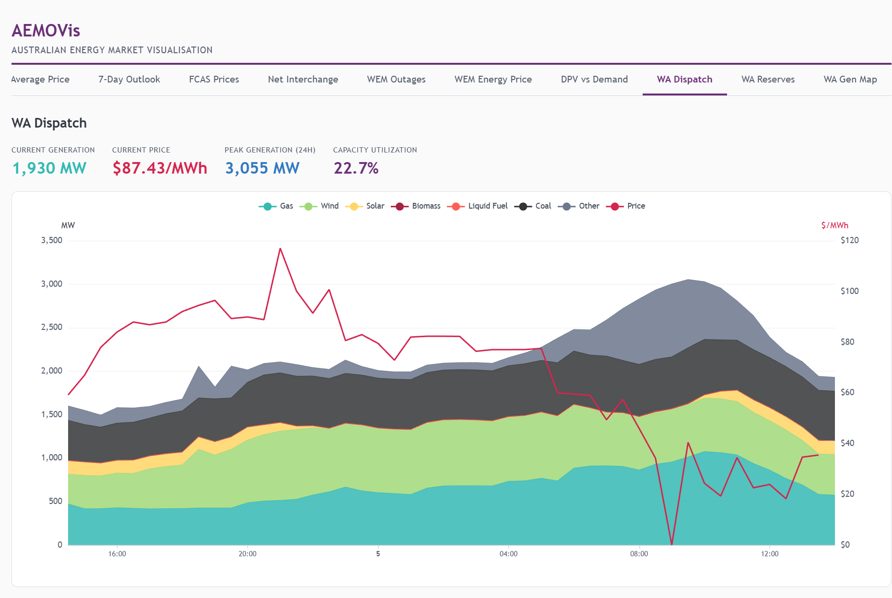

---

## 14. WA Reserves

Displays spinning reserve, LFAS (Load Following Ancillary Service) requirements, and forecast vs actual generation in the WEM. Essential for monitoring WA grid stability margins.

- **Forecast Demand** (dashed blue) — AEMO's demand forecast
- **Actual Generation** (solid teal) — real-time total generation
- **RTD Generation** (green) — Real-Time Dispatch generation
- **LFAS Up Requirement** (purple, right axis) — load following reserve requirement
- **Spinning Reserve** (red, right axis) — available spinning reserve
- **KPI row** — LFAS requirement, spinning reserve, actual generation, forecast accuracy

### Data Source

| Aspect | Value |
|--------|-------|
| **Endpoint** | `pulse.csv` |
| **Base URL** | `data.wa.aemo.com.au` |
| **Freshness** | 25 minutes |
| **Market** | WEM only |
| **Fields** | `RTD_TOTAL_SPINNING_RESERVE`, `LFAS_UP_REQUIREMENT_MW`, `FORECAST_EOI_MW`, `ACTUAL_TOTAL_GENERATION`, `RTD_TOTAL_GENERATION` |

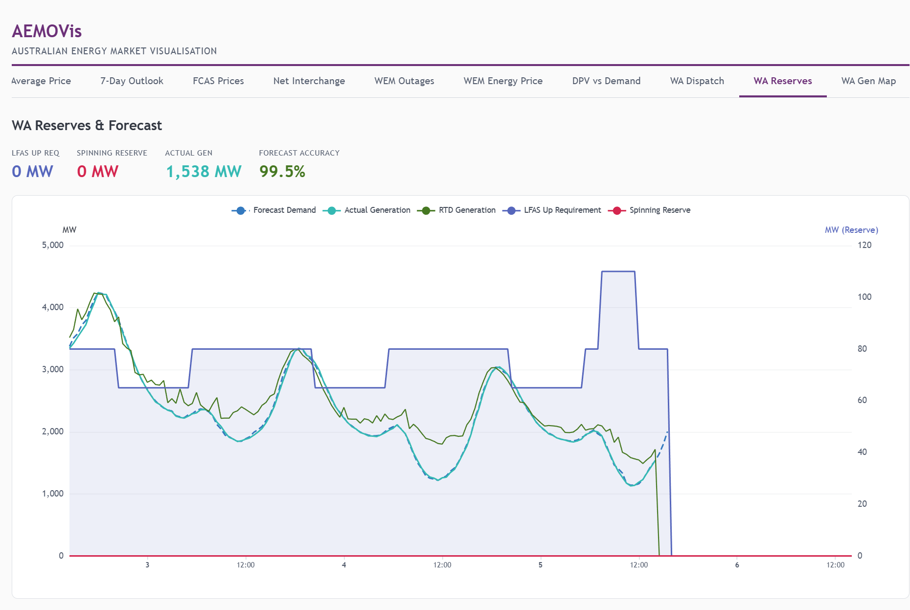

---

## 15. WA Gen Map

A geographic map of Western Australia with scatter overlay showing all registered generation facilities. Each facility is positioned by latitude/longitude, sized by current output, and coloured by fuel type.

- **Scatter overlay** on Australia map (WA highlighted)
- **Symbol size** proportional to current MW output
- **Colour by fuel type** — consistent with other fuel mix visualisations
- **Legend filtering** — click fuel types to show/hide
- **KPI row** — data timestamp, total facilities, generating facilities, total output, installed capacity
- Pan and zoom enabled for detailed exploration

### Data Source

| Aspect | Value |
|--------|-------|
| **Generation endpoint** | `generation.csv` |
| **Metadata endpoint** | `facility-meta-fuelmix.csv` |
| **Base URL** | `data.wa.aemo.com.au` |
| **Freshness** | Generation: 55 min, Metadata: 1 hour |
| **Market** | WEM only |
| **Fields** | `I01` (current output), `MAX_GEN_CAPACITY`, `LATITUDE`, `LONGITUDE`, `PRIMARY_FUEL`, `DISPLAY_NAME` |
| **GeoJSON** | Australia states (WA region highlighted) |

**Note:** Some facility coordinates in AEMO metadata are incorrect (defaulting to Perth CBD). The application includes coordinate corrections for known facilities based on Global Energy Observatory, Wikipedia, and planning documents.

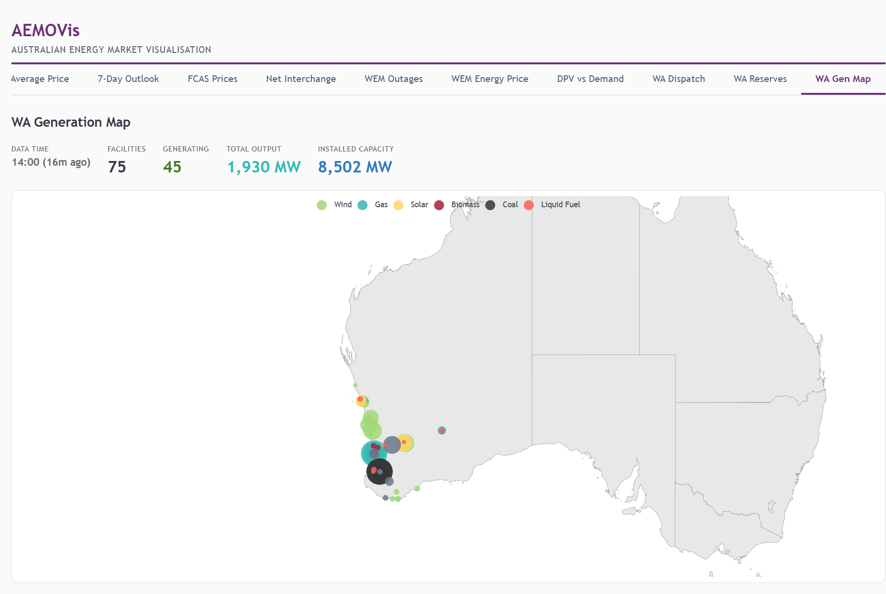

---

## Technical Notes

### Architecture

- **Framework:** Vanilla JavaScript SPA (no React/Vue/Angular)
- **Charting:** Apache ECharts 6.x for high-performance, interactive visualisations
- **State:** nanostores for reactive atom-based state management
- **HTTP:** ky for NEM REST API (with retry/timeout), native fetch for WEM CSVs
- **CSV Parsing:** PapaParse for WEM data files
- **Mapping:** ECharts geo component with Australia GeoJSON

### Data Sources Summary

| Market | Base URL | Format | Auth |
|--------|----------|--------|------|
| NEM | `dashboards.public.aemo.com.au` | JSON REST | API key (public) |
| WEM | `data.wa.aemo.com.au` | CSV files | None (CORS open) |

### Polling & Freshness

The application uses a dual-layer freshness system:

1. **fetchIfStale()** — On page mount, only fetches if data is older than freshness threshold
2. **Poller** — Background 60-second interval checks freshness before refetch

| Data Type | Freshness | Poll Interval |
|-----------|-----------|---------------|
| NEM API data | 4.5 minutes | 60 seconds |
| WEM pulse.csv | 25 minutes | 60 seconds |
| WEM generation.csv | 55 minutes | 60 seconds |
| WEM facility metadata | 1 hour | 60 seconds |

### WEM API Quirks

- **Accept header required:** WEM's IIS server returns 406 unless a browser-style Accept header is sent
- **CSV format:** All WEM data is CSV (not JSON)
- **No JSON APIs:** Historical JSON endpoints (ReferenceTradingPrice, EssentialServicesPricing) return 404

### Compare Mode

Available on: **Price and Demand**, **Fuel Mix**, and **Renewable Penetration**

- XY charts use overlaid series with region-specific colours
- Pie/donut charts use side-by-side positioning with adaptive sizing
- Radius shrinks gracefully as more regions are selected
